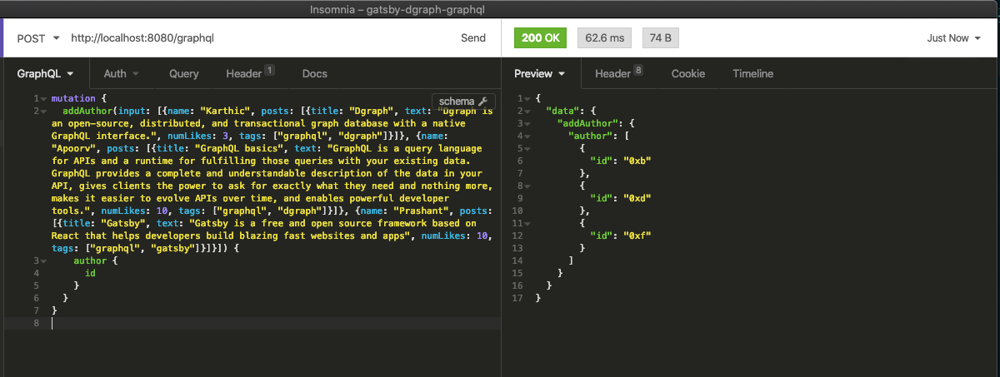

## gatsby-graphql-dgraph

Simple blog post application to get started with Gatsby and Dgraph's GraphQL API using the awesome plugin [gatsby-source-graphql](https://github.com/gatsbyjs/gatsby/tree/master/packages/gatsby-source-graphql).

Using [Dgraph](https://graphql.dgraph.io), you can get GraphQL APIs by just writing the GraphQL schema.

Dgraph auto-generates GraphQL APIs which provide you with capabilities to perform CRUD operations for the types defined in your GraphQL schema.

Dgraph provides custom directives for your GraphQL type definitions. You need to add them to your GraphQL schema to make use of some of Dgraph's advanced database features like full-text search.
Please check the docs [here](https://docs.dgraph.io/) for more info.

----

## Running the app 

First clone the repo

```sh
$ git clone https://github.com/dgraph-io/gatsby-dgraph-graphql.git
$ cd gatsby-dgraph-graphql
```

Starting Dgraph and then loading the schema

```sh
$ docker run -it -p 8080:8080 dgraph/standalone:v2.0.0-rc1
$ curl -X POST localhost:8080/admin/schema --data-binary '@schema.graphql'
```

To execute a query or mutation you can use [GraphQL Playground](https://github.com/prisma-labs/graphql-playground), [Insomnia](https://insomnia.rest/), [GraphiQL](https://github.com/graphql/graphiql) and [Altair](https://github.com/imolorhe/altair). Fire one of those up and point it to [http://localhost:8080/graphql](http://localhost:8080/graphql) .

Then you can run a couple of mutations to add author to the database along with the posts they have published, to have some sample data to show up when you start the app -

```graphql
mutation {
  addAuthor(input: [{name: "Karthic", posts: [{title: "Dgraph", text: "Dgraph is an open-source, distributed, and transactional graph database with a native GraphQL interface.", numLikes: 3, tags: ["graphql", "dgraph"]}]}, {name: "Apoorv", posts: [{title: "GraphQL basics", text: "GraphQL is a query language for APIs and a runtime for fulfilling those queries with your existing data. GraphQL provides a complete and understandable description of the data in your API, gives clients the power to ask for exactly what they need and nothing more, makes it easier to evolve APIs over time, and enables powerful developer tools.", numLikes: 10, tags: ["graphql", "dgraph"]}]}, {name: "Prashant", posts: [{title: "Gatsby", text: "Gatsby is a free and open source framework based on React that helps developers build blazing fast websites and apps", numLikes: 10, tags: ["graphql", "gatsby"]}]}]) {
    author {
      id
    }
  }
}
```

On the successful execution of the mutation -



Open another terminal and start the Gatsby app
```sh
$ yarn install
$ yarn start
```

Now you have a running Gatsby blog application powered by Dgraph's GraphQL API!

---
